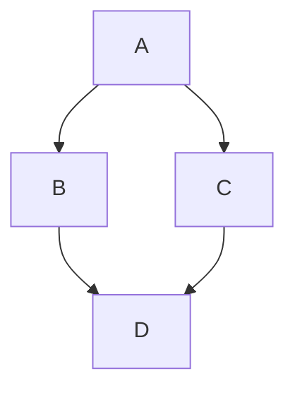

# Elastic Search

## Chapter 1

This is a reference to [Learning Go]()

```tpl
Get Home
Contribute

texto sem codigo

var a = "coisa"
```

```json
{"a": "teste"}

texto sem codigo

var a = "coisa"
```

```Shell
require 'redcarpet'
markdown = Redcarpet.new("Hello World!")
puts markdown.to_html

var a  = "coisa"

a++;

```

```Java
public class HelloWorld {
    public static void main(String[] args) {
        System.out.println("Hello, world!");
    }
}
```


Seems to be using Linguist: https://github.com/github-linguist/linguist

 Go To Linguist


Here is a simple flow chart:




## References
